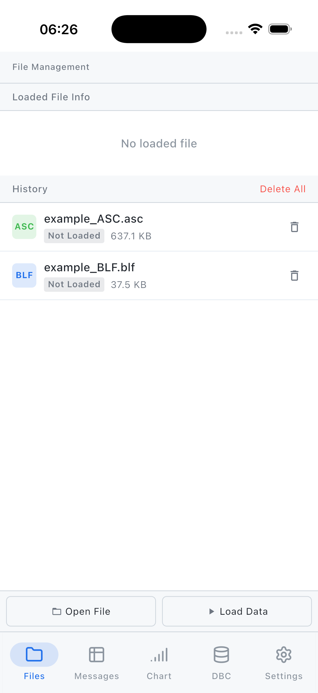
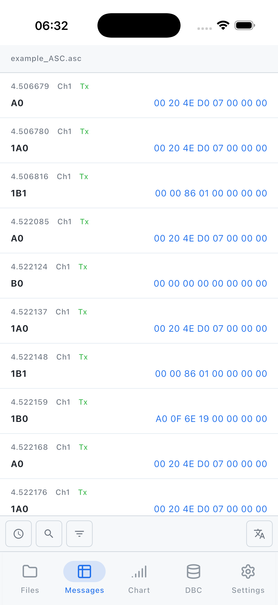
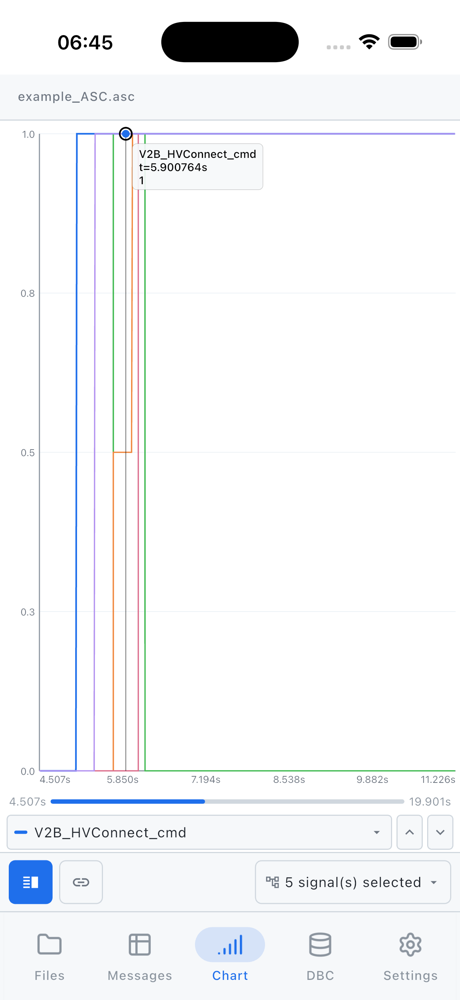
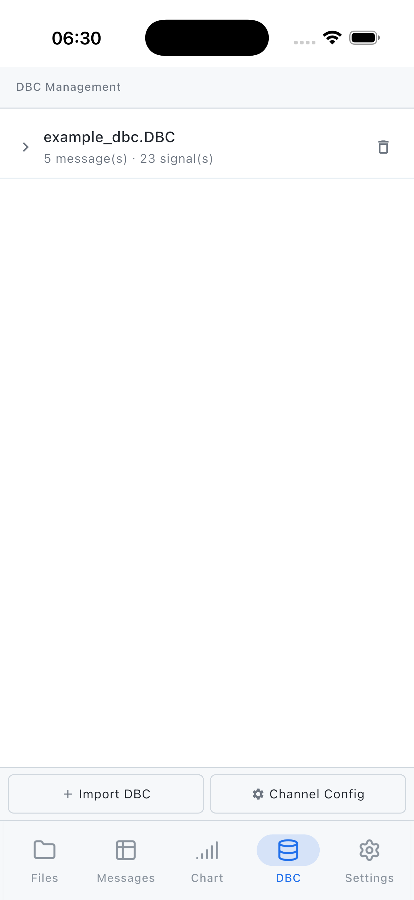

# MoLog

**Logs on the Go!**

**Offline CAN bus log analysis on your phone. Designed for automotive engineers who need to check signals on the road.**

---

## Why This App?

When you're on a road test or at a workshop, sometimes you just need to quickly check a CAN signal without opening a laptop.

**MoLog** is a lightweight, offline-first tool that puts DBC parsing and signal visualization in your pocket.

---

## Screenshots

| File Management | Message Browser | Chart Overlay | DBC Management |
|---|---|---|---|
|  |  |  |  |

---

## Free vs Premium

| Feature | Free | Premium |
|---------|------|---------|
| Log File Size | < 30 MB | Unlimited |
| DBC Files | Max 3 | Unlimited |
| DBC Signal Decoding | ✓ | ✓ |
| Jump to Time | ✓ | ✓ |
| Channel / Raw ID Filter | ✓ | ✓ |
| DBC-Based Filter | ✗ | ✓ |
| Signal Value Rule Scan & Jump | ✗ | ✓ |
| Chart — Split View | ✓ | ✓ |
| Chart — Overlay (Multi-Signal) | ✗ | ✓ |

### Trial & Pricing

- **3-day full-feature free trial** — no subscription required, all features unlocked from the moment you download
- **Lifetime** — one-time purchase, pay once and own forever
- **Launch discount** available for early adopters — redeem a promo code at checkout

---

## Supported Formats

- **Input**: BLF, ASC (more coming)
- **Database**: DBC

---

## Roadmap

- [x] MVP: Offline log viewing
- [x] DBC parsing
- [x] Multi-file comparison
- [ ] mf4 format support
- [ ] ARXML support

---

## Community & Feedback

- **Twitter**: [@MoLog_develop](https://x.com/MoLog_develop) — Development updates
- **Email**: [molog.develop@gmail.com](mailto:molog.develop@gmail.com)

---

## About the Developer

Automotive software engineer. Building tools to solve real-world testing pain points.

---

## Legal

- [Privacy Policy](privacy_policy_en)
- [Terms of Service](terms_of_service_en)
